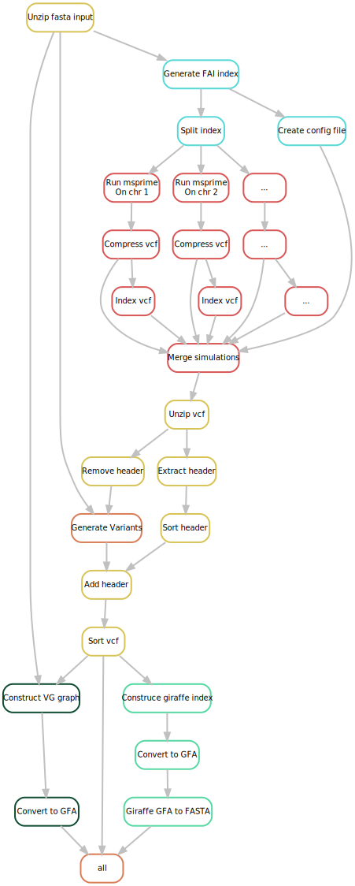

# Warnings / Issues

> **`/!\`:** Act with care; this workflow uses significant memory if you increase the values in `.masterconfig`. We recommend keeping the default settings and running a test first.

> **`/!\`:** For now dont run multiple split at once

# How to Use
## A. Running on a cluster
### 1. Set up
Clone the Git repository
```bash
git clone https://forgemia.inra.fr/pangepop/MSpangepop.git
cd MSpangepop
```

### 2. Add your files
- Add a `.fasta.gz` file; an example can be found in the repository.

### 3. Configure the pipeline
- Edit the `masterconfig` file in the `config/` directory with your sample information. 
- Edit the `visor_sv_type.yaml` file with the mutations you want.
- Edit `job.sh` with your email and add path to the needed modules (Singularity/Apptainer, Miniconda3)
- Provide the needed conda environement in `job.sh`, under `source activate wf_env`you can create it using :
```bash
conda create -n wf_env -c conda-forge -c bioconda snakemake=8.4.7 snakemake-executor-plugin-slurm
conda init bash
```

### 4. Run the WF
The workflow has two parts: `split` and `simulate`. Always run the split first and once its done (realy quick) run the simulate.
```bash
sbatch job.sh [split or simulate] dry
```
If no warnings are displayed, run:
```bash
sbatch job.sh [split or simulate] 
```
> **Nb 1:** to create a visual representation of the workflow, use `dag` instead of `dry`. Open the generated `.dot` file with a [viewer](https://dreampuf.github.io/GraphvizOnline/) that supports the format.

> **Nb 2:** Frist execution of the workflow will be slow since images need to be pulled.

> **Nb 3:** The workflow is in two parts because we want to execute the simulations chromosome by chromosome. Snakemake cannot retrieve the number of chromosomes in one go and needs to index and split first.

## B. Run localy
- Ensure `snakemake` and `singularity` are installed on your machine, then run the workflow:
```bash
./local_run [split or simulate] dry
```
If the workflow cannot download images from the container registry, install `Docker`, log in with your credentials, and rerun the workflow:
```bash
docker login -u "<your_username>" -p "<your_token>" "registry.forgemia.inra.fr" 
```

# Workflow


# More informations

The variants generation is inspired by [VISOR](https://github.com/davidebolo1993/VISOR).

You can extract a VCF from the graph using the `vg deconstruct` command. It is not implemented in the pipeline.

## Helper script 
You can use the script `workflow/scripts/split_path.sh` to cut the final fasta into chromosome level fasta files. 

Example use :
```bash
./workflow/scripts/split_path.sh input.fasta results/test_sample1_results/06_graph_paths/test_sample1_paths.fasta ./out
```

# Dependencies
TODO
pandas, msprime, argprase, os, multiprocessing, yaml, Bio.Seq
singularity, snakemake
vg:1.60.0, bcftools:1.12, bgzip:latest, tabix:1.7. 