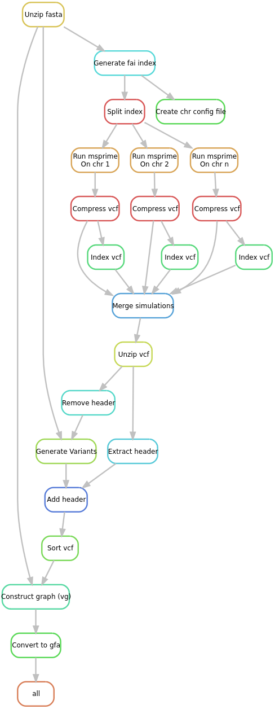

# How to Use
> **`/!\`:** Act with care; this workflow uses significant memory if you increase the values in `.masterconfig`. We recommend keeping the default settings and running a test first.

## Running on the CBIB
### 1. Set up
Clone the Git repository and switch to my branch:
```bash
git clone https://forgemia.inra.fr/pangepop/MSpangepop.git
cd MSpangepop
git checkout dev_lpiat
```

### 2. Add your files
- Add a `.fasta.gz` file; examples can be found in the repository

### 3. Configure the pipeline
- Edit the `.masterconfig` file and the `visor_sv_type.yaml` in the `.config/` directory to suit your needs. 
- Edit the `job.sh` and the `./config/snakemake_profile/clusterconfig.yaml` with your email.

### 4. Run the WF
The workflow has two parts: `split` and `simulate`. Run the following command:
```
sbatch job.sh [split, simulate] [dry, dag]
```
If no warnings are displayed, run:
```
sbatch job.sh [split, simulate] 
```
> **Nb:** to create a visual representation of the workflow, use [dag]. Open the generated `.dot` file with a [viewer](https://dreampuf.github.io/GraphvizOnline/) that supports the format.

## Run localy
- Ensure `snakemake` and `singularity` are installed on your machine.
- Modify the `.masterconfig` file and `visor_sv_type.yaml` in the `.config/` directory as needed.

```
./local_run [split, simulate] [dry, dag]
```

If the workflow cannot download images from the container registry, install `Docker`, log in with your credentials, and rerun the workflow:
```
docker login -u "<your_username>" -p "<your_token>" "registry.forgemia.inra.fr" 
```

# Workflow



# More informations

The variants generation is inspired by [VISOR](https://github.com/davidebolo1993/VISOR). YAML template is available in `VISOR_random_bed` folder. Modify the YAML input to set the percentage of each variant you want to simulate (must equal 100).

Each variant type has a size distribution file (bins = 100 bp) in folder `sv_distributions`. The data was extracted from [An integrated map of structural variation in 2,504 human genomes (Sudmant, et al. 2015)](https://www.nature.com/articles/nature15394).

The distributions are used to randomly sample each structural variant size.

## Create exact data with vg
In the `vg_extact_data` folder.

Snakemake/Singularity pipeline to get a pangenome in GFA format and a FASTA with all individuals from the VCF. Starts from a reference FASTA and a VCF to specify in the `config.yaml` file, with a name for the output (**WARNING**: think to set the correct email address in `config.yaml`).

Create directory or modify the SBATCH options in `job.sh` (**WARNING**: think to set the correct email address in `job.sh` if you want to receive the slurm emails).
```
mkdir -p slurm_logs
```
On SLURM cluster, run `sbatch job.sh dry` for a dry run or `sbatch job.sh` directly. Adjust the `SNG_BIND` variable if files are not found and the snakemake profile as necessary for performance.

You can extract a VCF from the graph using the `vg deconstruct` command. It is not implemented in the pipeline.
