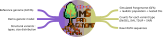

# MSpangepop 

MSpangepop is a workflow for simulating pangenome variation graphs from coalescent simulations.\
A simplified description of the algorithm can be found [here](https://lpiat-pages-cfefee.pages-forge.inrae.fr/poster_bims_lucien.pdf).

The official MSpangepop repository can be found at the [INRAE forge](https://forge.inrae.fr/pangepop/MSpangepop).\
A GitHub mirror can be found at [INRAE GitHub](https://github.com/inrae/MSpangepop).\
The mirror is especially useful for people with no Renater account to submit issues.



### Documentation

|  |  |
|-------|-------------|
| **[Master Configuration](doc/configuration_master.md)** | How to set up configuration files and parameters |
| **[Demographic model](doc/configuration_model.md)** | Adapt or create a model |
| **[Output Files](doc/output_files.md)** | Description of generated results and outputs |
| **[Advanced Topics](doc/go_even_deeper.md)** | In-depth information for power users |

### Workflow Stages

| Stage | Process | Scripts | Rules |
|-------|---------|---------|--------|
| **1. Setup** | → Validate FASTA/YAML<br>→ Expand configs<br>→ Create index | `input_index.py`<br>`sample_ranges.py`<br>`recap.py` | setup |
| **2. Msprime Simulation** | → Build demographic model<br>→ Run msprime<br>→ Generate visualizations | `msprime_simulation.py`<br>`visualizer_arg.py`<br>`visualizer_tree.py` | msprime_simulation <br>visualization  |
| **3. Preprocessing** | → Split by locus<br>→ Preorder traverse trees<br>→ Define SVs type lenght and position | `coalescent_traversal.py`<br>`draw_variants.py`<br>`split_recombination.py` | coalescent_traversal<br>draw_variants<br>split_recombination |
| **4. Graph Creation** | **Initialize:** Build locus ancestral graphs<br>**Mutate:** Apply variants using MSpangepop library<br>**Save:** Assign IDs → Merge subgraphs→ Lint → Export chopped graph | `graph_creation.py`<br>`graph_utils.py`<br>`matrix.py` | graph_creation |
| **5. Unchop** | VG unchop command | - | graph_merging |

---
## How to Use 
### 1. Set up

Clone the Git repository
```bash
git clone https://forge.inrae.fr/pangepop/MSpangepop 
```

- Create an environement for snakemake (from the provided envfile): 
```bash
conda env create -n wf_env -f dependencies/wf_env.yaml
```  

### 2. Configure the pipeline for your data

Three elements are needed to run the simulation : 
- The `masterconfig` -> **[Master Configuration](doc/configuration_master.md)**
- The `demographic_file`  -> **[Demographic model configuration](doc/configuration_model.md)**
- A reference genome "`fasta_gz`" (must be telomere to telomere, you can run on 1 chromosome only, to test the configuration)

#### To do a quick test : 

Edit the `masterconfig` file in the `.config/` directory with your sample information. (**[Master Configuration](doc/configuration_master.md)**)

```bash
nano .config/masterconfig.yaml
```

Example config:
```yaml
samples:
  test_run:
    model: "simulation_data/Panmictic_Model.json"
    replicates: 1
```
- `model` is the demographic scenario the simulation will run on. You can create your own or tailor the ones in `./simulation_data` (**[Demographic model configuration](doc/configuration_model.md)**)


- **⚠️ Don't want to create your own model?⚠️** Use the provided `Panmictic_Model.json` - simply edit it to specify your genome (`fasta_gz`), then adjust `mutation_rate` and `recombination_rate` (start with low values)


### 3. Run the workflow 
#### On the cluster
- Run the workflow :
```bash
sbatch mspangepop dry # Check for warnings
sbatch mspangepop run # Then
```
> **Nb :** If your account name can't be automatically determined, add it in the `.config/snakemake/profiles/slurm/config.yaml` file.

> **Nb :** Use the command `squeue --format="%.10i %.9P %.6j %.10k %.8u %.2t %.10M %.6D %.20R" -A $user` to see job **names**

#### Localy
```bash
./mspangepop dry # Check for warnings
./mspangepop local-run # Then
```

## Other running options
```
mspangepop [dry|run|local-run|dag|rulegraph|unlock|touch] [additional snakemake args]
    dry - run in dry-run mode
    run - run the workflow with SLURM
    local-run - run the workflow localy (on a single node)
    dag - generate the directed acyclic graph for the workflow
    rulegraph - generate the rulegraph for the workflow
    unlock - Unlock the directory if snakemake crashed
    touch - Tell snakemake that all files are up to date (use with caution)
    [additional snakemake args] - for any snakemake arg, like --until hifiasm
```

## Path Operations in Mspangepop

MSpangepop implements graph path operations to add variants by modifying how lineages traverse the graph. 

**Core Features:**
- **Multi-path targeting** - Operations apply to single or multiple lineage paths simultaneously, enabling both unique and shared variants
- **Orientation-aware** - All operations preserve node directionality using edges that track exit and entry node sides, creating orientation-aware links (++, +-, -+, --)
- **Composable** - Operations can be nested and overlapping (e.g., deletion within inversion), representing complex compound variants

These operations modify paths through existing nodes rather than altering the graph structure, maintaining shared sequences while creating alternative routes for different lineages.  New nodes (e.g., for insertions) are generated using an order 1 Markov model to produce realistic sequences.

| Operation | Function | Used For | Path Change |
|-----------|----------|----------|-------------|
| `bypass(a,b)` | Skip nodes a to b | Deletions | Creates shortcut edge |
| `loop(a,b)` | Duplicate nodes a to b | Tandem duplications | Adds loop-back + repeat |
| `invert(a,b)` | Reverse nodes a to b | Inversions | Flips path direction |
| `swap(a,node)` | Replace node at position a | SNPs | Substitutes single node |
| `paste(a,a+1,nodes)` | Insert between adjacent nodes | Insertions | Adds new node sequence |

## Support and Development

MSpangepop is developed at INRAE as part of the PangenOak project.


